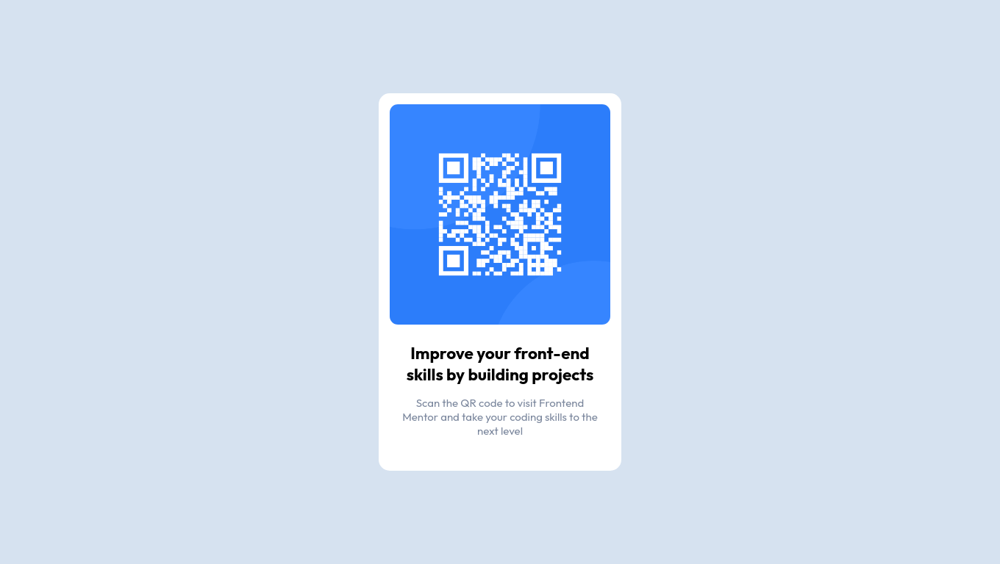

# Frontend Mentor - QR code component solution

This is a solution to the [QR code component challenge on Frontend Mentor](https://www.frontendmentor.io/challenges/qr-code-component-iux_sIO_H). Frontend Mentor challenges help you improve your coding skills by building realistic projects.

## Table of contents

- [Screenshot](#screenshot)
- [Links](#links)
- [My process](#my-process)
  - [Built with](#built-with)
  - [What I learned](#what-i-learned)
  - [Useful resources](#useful-resources)
- [Author](#author)
- [Acknowledgments](#acknowledgments)

### Screenshot

### Links

- Solution URL: [Add solution URL here](https://github.com/abyanfalah/frontend-mentor-qr-image)
- Live Site URL: [Add live site URL here](https://amazing-meringue-d725e0.netlify.app)

## My process

- Create HTML structure
- Get fonts
- Add CSS variables
- Put .content class max-width to ~350px
- Put image
- Style the image
- Put texts
- style the texts
- add shadow to .content

### Built with

- Flexbox
- Mobile-first workflow (tho i don't know if it does)

### What I learned

- Setting margin, padding, size etc. with `em` unit which is pretty convenient.
- Setting max-width controls the maximum size of an element. Good for designing for various screen size.

### Useful resources

[W3School](www.w3school.com)

## Author

- Frontend Mentor - [@abyanfalah](https://www.frontendmentor.io/profile/abyanfalah)

## Acknowledgments

I (extremely) rarely use pure css. Most of the time I use CSS framework/library.
Tried to google as minimum as possible.
